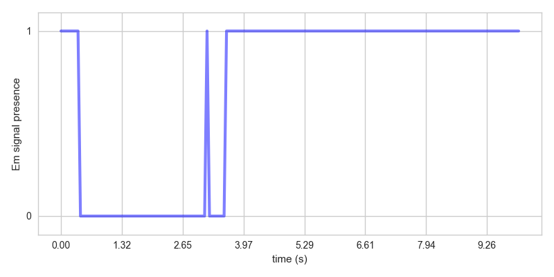
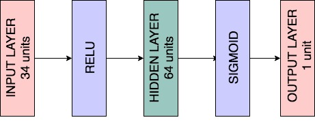

# Emergency-Vehicle-Detection
This repository contains implementation of papers on sound-based Emergency Vehicle Detection in Python.  

## Requirements and setup
`Paper-1` and `Paper-2` have been implemented in Python-3 while `Paper-3` has been implemented in Python-2 in the [Anaconda](https://anaconda.org/anaconda/python) environment. The directories `Paper-2` and `Paper-3` contain the list of modules that need to be installed in the `requirements.txt` files. Please note that 2 separate environments need to be created for running the files in Paper-2 and Paper-3.  

Once Anaconda is installed, to create an environment with the required modules simply run `conda create --name <env> --file requirements.txt` in the command window.  

## Running the files
Running `python em_detection.py` leads to training the model on the train data and displaying the performance metrics of the classifier on the test data.  

`test_audio_file.py` reads an audio file and plots the probability of the presence of an emergency signal vs time in the audio clip. A sample output looks like as shown below.  

## Paper-1
[A real-time siren detector to improve safety of guide in traffic environment](https://ieeexplore.ieee.org/document/7080691/)

This paper used only 1 feature i.e. the periodicity of the audio signal to identify the presence of a siren. Emergency signals in general have a periodic pattern which repeats over a short duration of time. Additionally, they also belong to specific frequency bands which lends them the high pitch sound that they are usually associated with. The paper exploited these characteristics pertaining to emergency signals by using a pitch detection algorithm. The pitch detection algorithm is a time domain technique which aims to categorize each portion of an audio signal as pitched or unpitched. A Modified Pitch Detection (MDF) algorithm which is a less computationally expensive version of the autocorrelation function is used to find the pitch. Using the MDF vs the lag plot, the pitch of the signal is detected. A pitch vs time plot is then used to determine the pitch found in each small audio sample of size 512 samples. An emergency signal estimator that calculates the fraction of time for which the pitch remains inside the frequency band for emergency signals predicts the presence of an emergency signal in the audio sample.

There are better versions of the MDF algorithm which make the pitch detection more accurate. CAMDF (Circular Average Magnitude Difference Function) was used to calculate the pitch in our case as it resulted in more accurate results.  

It was observed that the algorithm performed well only if the profile of the emergency signals is known, stay fairly constant, and do not have a lot of ambient noise added. But in real life scenarios this is seldom the case. On the data that we used to test the algorithm, there were a lot of false negatives and false positives as many of the audio samples had a wide variety of emergency sounds. At times the noise in the audio samples made it hard for the algorithm to identify emergency signals.  

The pitch detection technique is a simple approach that assumes that all emergency signals are periodic in nature. But, this is not the case in real-world situations as many emergency signals do not follow this pattern. Moreover, a lot of times emergency signals are mixed with other sounds and noise that makes it difficult for the algorithm to identify the pitch of the emergency signal.  

One way to improve the results would be to look at features that are more representative of emergency signals and also robust to some level of noise. The range of frequency at which emergency signals operate is an important factor that could be considered. Using a simple bandpass filter might be helpful in eliminating some of the noise and make it easier to focus only on the frequency range where emergency sounds lie. Mel Frequency Cepstral Coefficients (MFCCs) are known to perform very well on speech recognition tasks. They are a good representation of the audio signals and follow some of the basic principles in which the human auditory system works. But, since these features can’t be interpreted by just looking at their values, they are fed to a machine learning classifier. The classifier learns to detect patterns in the input data to distinguish between emergency signals and non-emergency signals. One such approach has been used in the paper described in the next section.

## Paper-2
[An Automatic Emergency Signal Recognition System for the Hearing Impaired](https://ieeexplore.ieee.org/document/4041054/)

Mel Frequency Cepstrum (MFC) is a representation of the short-term power spectrum of a sound. The Mel Frequency Cepstral Coefficients (MFCCs) are coefficients that collectively make up an MFC. The advantage of the cepstrum on a Mel scale is that the Mel scale resembles closely to the human auditory system’s response as compared to the normal cepstrum on a linear scale. This frequency warping allows better representation of sound. These features have been used extensively for audio processing and speech recognition tasks. In this paper 12 MFCC features were extracted from each 20 ms of the audio signal. The MFCCs were then fed to a machine learning classifier that tries to identify if the short audio clip contains an emergency signal or not. The classifier used in this paper is an Artificial Neural Network (ANN). The input layer of the network contains 12 nodes for the 12 MFCCs. The hidden layer contains 24 nodes. The output layer contains 1 node containing the probability of the presence of emergency signal in the audio sample.  

The diagram below shows the architecture of the ANN:  

In real-life classifying 20 ms short audio clips is not a great idea as the prediction may not be often steady due to the presence of noise in the audio samples. So, the predictions from 20 consecutive 20 ms audio clips were averaged. This introduced a delay of 400 ms but helped reduce the false alarms to a large extent.  

The table below shows the Confusion Matrix for the samples in the test data: 

|                       | Predicted Emergency          | Predicted Non-Emergency |
|:---------------------:|:----------------------------:|:-----------------------:|
| Actual Emergency      | 107                          | 27                      |
| Actual Non-Emergency  | 11                           | 94                      |

The results on this dataset are encouraging as I obtained about 84% accuracy on the evaluation dataset. More importantly the precision is close to 90% and the recall is close to 80%.  

It was observed that in general emergency signals that had a lot of spurious noise mixed along with them were consistently misclassified by the ANN. Also, in many cases the ANN failed to learn the features of emergency signals that were unique which led to misclassification. A possible solution to this issue would be to use more training data with samples that are unique. Another solution would be to use a wider variety of features to get that could be helpful in distinguishing between emergency and non-emergency signals. The latter step has been described in the next section.  

## Paper-3
[Detection of alarm sounds in noisy environments](https://ieeexplore.ieee.org/abstract/document/8081527/)

A particular characteristic of alarm sounds reported by the authors in this paper is that alarm sounds usually belong to one of the 3 categories:
1.	Pulsed alarms: Consisting of repetition of the same sound with a silent gap between each instance
2.	Sirens: Sounds in which the frequency continuously changes
3.	Alternating alarms: Consisting of 2 different alternating tones with no silence gap between them  

It is difficult to build a general model that takes all these types of emergency sounds into account. In real-world situations these sounds are mixed with ambient background noise and frequency shifts due to Doppler effect. This is the reason why a lot of approaches do not work well outside the laboratory. This paper used a large set of features so that the audio signals could be characterized better.  

The first step in this approach was to eliminate noise and spurious sounds. This was achieved by using a band-pass filter to remove frequencies form the audio samples that were outside the region of interest. A combination of 3 different categories of features, time-domain, frequency-domain, and wavelet-based features were used in the approach. The time domain features used were the pitch, short time energy, and zero crossing rate. The frequency domain features used were MFCC, spectral flux, spectral roll-off, spectral centroid, and spectral flatness. Wavelet coefficients capture time and frequency localized information about the audio waveform. The wavelet-based features used were discrete wavelet transform and wavelet packet transform. The paper also used additional statistics such as mean, standard deviation, maximum, minimum, median, etc. extracted from the 3 categories of features. Feature selection was performed using the ‘reliefF’ algorithm. This helped in lowering down the number of features by about 12% without a reduction in the accuracy. These features were then fed to a machine learning classifier to classify the audio samples into emergency and non-emergency sounds. The classifier used in this algorithm was a Support Vector Machine.  

In our implementation, we just used the raw features extracted from 100 ms short audio samples with a 50 ms overlap between adjacent samples. We haven’t computed the additional statistics and added them to the feature set. We used 34 features extracted from each audio sample. Also, from implementation of the previous paper we have a good idea that an ANN performs well as a classifier. So, we used an ANN in which the input layer contained 34 nodes which was the same as the number of features. The subsequent hidden layers consisted of 64, 128, and 256 units with ‘ReLU’ activation. The output layer consisted of 1 node with ‘Sigmoid’ activation. Also, to obtain a steady output, we averaged the prediction over the last 10 consecutive short audio samples. This introduced a processing time delay of 1 s for prediction.  

The diagram below shows the architecture of the ANN:

The table below shows the Confusion Matrix for the samples in the test data: 

|                       | Predicted Emergency          | Predicted Non-Emergency |
|:---------------------:|:----------------------------:|:-----------------------:|
| Actual Emergency      | 108                          | 26                      |
| Actual Non-Emergency  | 4                            | 101                     |

In most of the cases when the false negatives occur i.e. the signal is actually an emergency signal but is labeled incorrectly as a non-emergency signal by the classifier, there is a lot of noise present in the audio signals which overpowers the strength of the emergency signals.  

The next practical step to improve the detection would be to combine audio and visual information. An object detection algorithm that can detect the presence of an emergency vehicle in the video feed captured using a camera combined with the sound-based emergency vehicle detection algorithm can provide much improved results. This would help reduce the number of false positives and false negatives to a large extent.
